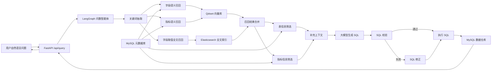

# 掌柜问数

掌柜问数是一个面向数据仓库场景的自然语言查数系统。用户可以用中文提出业务问题，系统通过元数据检索、指标理解、SQL 生成、SQL 校验和查询执行等步骤，把自然语言问题转换为可执行的数据仓库查询，并以流式接口返回结果。

核心目标是降低业务人员使用数据仓库的门槛，让常见经营分析、指标查询和维度筛选可以通过对话方式完成。

## 核心能力

- 自然语言查数：用户通过 `/api/query` 提交中文问题，系统自动完成 SQL 生成与查询。
- 元数据知识库：使用 MySQL 统一管理表、字段、字段关系和指标定义。
- 多路召回：结合 Qdrant 向量检索和 Elasticsearch 全文检索召回字段、指标和维度取值。
- 可控 Agent 流程：基于 LangGraph 编排关键词抽取、召回、筛选、SQL 生成、校验、修正和执行。
- 工程化服务：使用 FastAPI 提供 HTTP/SSE 接口，配置、日志、客户端和仓储层按模块拆分。

## 系统架构



## 技术栈

- Web 框架：FastAPI
- Agent 编排：LangGraph
- LLM/Embedding 集成：LangChain、LangChain HuggingFace
- 元数据库与数据仓库：MySQL 8.0
- ORM/异步驱动：SQLAlchemy、asyncmy
- 向量检索：Qdrant
- 全文检索：Elasticsearch、Kibana
- 中文分词：jieba
- 配置管理：OmegaConf、YAML
- 日志：Loguru
- 依赖管理：uv
- 基础服务编排：Docker Compose

## 目录结构

```text
.
├── app/
│   ├── agent/          # LangGraph 智能体、状态、上下文和节点
│   ├── api/            # FastAPI 路由、依赖注入和接口 Schema
│   ├── clients/        # MySQL、Qdrant、Elasticsearch、Embedding 客户端
│   ├── conf/           # 配置加载代码
│   ├── core/           # 日志、请求上下文等基础能力
│   ├── entities/       # 业务实体
│   ├── models/         # SQLAlchemy ORM 模型
│   ├── prompt/         # Prompt 加载工具
│   ├── repositories/   # MySQL / Qdrant / Elasticsearch 访问层
│   ├── scripts/        # 元数据知识库构建脚本
│   └── services/       # 查询服务和元数据服务
├── conf/               # 应用配置和元数据配置
├── docker/             # MySQL、Elasticsearch、Qdrant、Embedding 服务配置
├── prompts/            # 静态 Prompt 模板
├── main.py             # FastAPI 应用入口
├── pyproject.toml      # Python 项目与依赖定义
└── uv.lock             # uv 锁定文件
```

## 快速开始

### 1. 安装依赖

项目使用 `uv` 管理依赖和虚拟环境：

```bash
uv sync
```

如果需要重新安装依赖，可以参考：

```bash
uv add fastapi[standard] sqlalchemy asyncmy qdrant-client "elasticsearch[async]>=8,<9" langchain langchain-huggingface langgraph jieba omegaconf pyyaml loguru cryptography
```

### 2. 配置敏感信息

仓库不会提交真实 API Key。启动前请在本机环境变量中设置：

```bash
export LLM_API_KEY="你的大模型 API Key"
```

`conf/app_config.yaml` 中的 `llm.api_key` 会通过 `${oc.env:LLM_API_KEY,}` 从环境变量读取。

如果需要修改数据库、Qdrant、Elasticsearch、Embedding 或大模型地址，请调整 `conf/app_config.yaml`。

### 3. 启动基础服务

进入 Docker 配置目录并启动服务：

```bash
cd docker
docker compose up -d
```

默认会启动：

- MySQL：`localhost:3306`
- Elasticsearch：`localhost:9200`
- Kibana：`localhost:5601`
- Qdrant：`localhost:6333`
- Text Embedding Inference：`localhost:8081`

说明：本仓库默认不提交本地 embedding 模型权重和第三方服务源码。请按项目资料或模型来源准备 `docker/embedding/bge-large-zh-v1.5/` 目录后再启动 embedding 服务。

### 4. 构建元数据知识库

基础服务启动后，执行元数据构建脚本：

```bash
uv run python -m app.scripts.build_meta_knowledge -c conf/meta_config.yaml
```

该脚本会读取 `conf/meta_config.yaml` 中的数据仓库表、字段和指标配置，写入 MySQL 元数据库，并为字段、指标和维度取值构建向量索引与全文索引。

### 5. 启动 API 服务

```bash
uv run fastapi dev main.py
```

或使用 uvicorn：

```bash
uv run uvicorn main:app --reload
```

### 6. 调用示例

```bash
curl -N -X POST "http://127.0.0.1:8000/api/query" \
  -H "Content-Type: application/json" \
  -d '{"query":"统计华北地区销售总额"}'
```

接口以 `text/event-stream` 形式返回智能体执行过程和最终查询结果。

## Agent 流程说明

当前 LangGraph 流程定义在 `app/agent/graph.py`：

1. `extract_keywords`：从用户问题中抽取关键词。
2. `recall_column`：从 Qdrant 召回相关字段。
3. `recall_metric`：从 Qdrant 召回相关指标。
4. `recall_value`：从 Elasticsearch 召回维度字段真实取值。
5. `merge_retrieved_info`：合并多路召回结果。
6. `filter_table`：筛选和问题相关的数据表。
7. `filter_metric`：筛选和问题相关的指标定义。
8. `add_extra_context`：补充生成 SQL 所需上下文。
9. `generate_sql`：调用大模型生成 SQL。
10. `validate_sql`：校验 SQL 是否可用。
11. `correct_sql`：当校验失败时修正 SQL。
12. `run_sql`：执行 SQL 并返回结果。

## 配置说明

主要配置文件：

- `conf/app_config.yaml`：运行时配置，包括日志、数据库、Qdrant、Embedding、Elasticsearch 和 LLM。
- `conf/meta_config.yaml`：数据仓库元数据配置，包括表、字段、字段别名、同步策略和指标定义。

默认配置面向本地 Docker Compose 开发环境。如果部署到服务器，请相应修改主机地址、端口、账号和模型服务地址。

## 安全说明

- 不要把真实的大模型 API Key、云厂商密钥或生产数据库密码提交到仓库。
- 推荐使用环境变量、CI/CD Secret 或部署平台的密钥管理能力注入敏感配置。
- 本仓库 `.gitignore` 已排除 `.env`、日志、本地模型权重、IDE 文件和第三方服务源码缓存。

## 许可证

本项目用于学习和课程项目实践。如需商用或二次分发，请确认相关课程资料、模型和第三方组件的授权要求。
